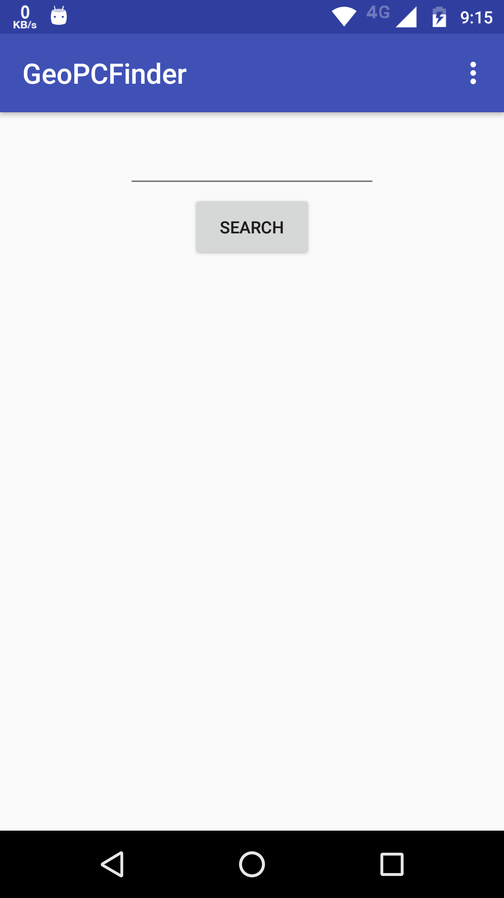

#Buscador de Códigos Postales
###Video demostrativo
https://youtu.be/J4e6TpEDQAo

###Esta aplicación hace uso de los servicos y API de geonames.com para mostrar las colonias pertenecientes a un código postal.
###Vemos la interfáz gráfica, consta de un campo de texto numérico y un botón.

###Insertamos un código postal válido mexicano y nos mostrará las priemras 20 colonias que pretenezcan a dicho CP.

###Al hacer click en algún elemento se nos guiará a Google Maps para mostrarnos la colonia seleccionada.

###Veamos otro ejemplo con otro código postaly colonia.

###También podemos obsrvar que la caja de texto no perminte hacer una búsqueda si está vacía.

###En el menú superior encontramos la opción "About" que muestra mi información personal en una actividad flotante.
